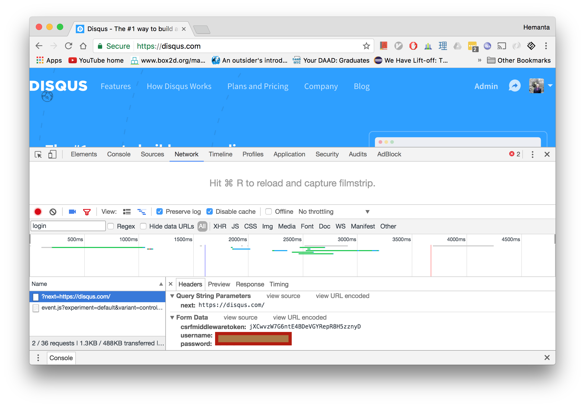

# djangobot
[Curl](https://curl.haxx.se/) for [Django](https://www.djangoproject.com/). Make authenticated requests to a Django server.

# How does it work ?

Django authentication relies on two cookies: **csrfmiddlewaretoken** and **sessionid**. Once you accquire these cookies, you can make authenticated requests just like the browser does.

Getting the **csrfmiddlewaretoken** is easy. Just make a request to a page and the server sends back the cookie. 

**Sessionid**, however is tricky because most production servers configure it as a [secure HTTP only](https://docs.djangoproject.com/en/1.11/ref/settings/#std:setting-SESSION_COOKIE_SECURE) cookie. It is only sent if authentication is made securely ( via. HTTPS )

To make a secure connection we need SSL/TLS certificates. GO has a package called [autocert](https://godoc.org/golang.org/x/crypto/acme/autocert) which lets us accquire these certificates.

With certs in place, all we need is the authentication details and we're good to go.

# What are the potential use cases for this library ?

* API testing
* Web Scraping
* Automation
* Bot frameworks
* Mobile apps

See an example usage below.

# Installation

* Add ```github.com/hemantasapkota/djangobot``` as an import to your project.
* Execute ```go get github.com/hemantasapkota/djangobot```

# Usage
In this example, we'll authenticate with Disqus ( https://disqus.com/ ) which is built on top of Django. Let's inspect the parameters that get sent to the login endpoint.



The query parameter is **next** and the form data items are **csrfmiddlewaretoken**, **username**, and **password**.

We'll do the same. But before being able to call the login endpoint we'll need the CSRF token. Let's get the CSRF token.

```
bot := djangobot.With("https://disqus.com/profile/login/").
		 AddHost("disqus.com").
		 SetUsername("<<username>>").
		 SetPassword("<<password>>").
                 LoadCookies()

if bot.Error != nil {
	panic(bot.Error)
}
```

Next, let's authenticate with the server. Django expects the csrf token to be sent as the **csrfmiddlewaretoken** HTTP header.

```
client, err := bot.Set("next", "https://disqus.com/").
		   X("csrfmiddlewaretoken", bot.Cookies["csrftoken"].Value).
		   X("username", bot.Username).
		   X("password", bot.Password).
		   Login()

if err != nil {
	panic(err)
}
```

Successful authentication creates the **sessionid** cookie.

```
cookie, ok := bot.Cookies["sessionid"]
if !ok {
	panic("Authentication failed.")
}
  
 fmt.Println(cookie.Value)
  
```
